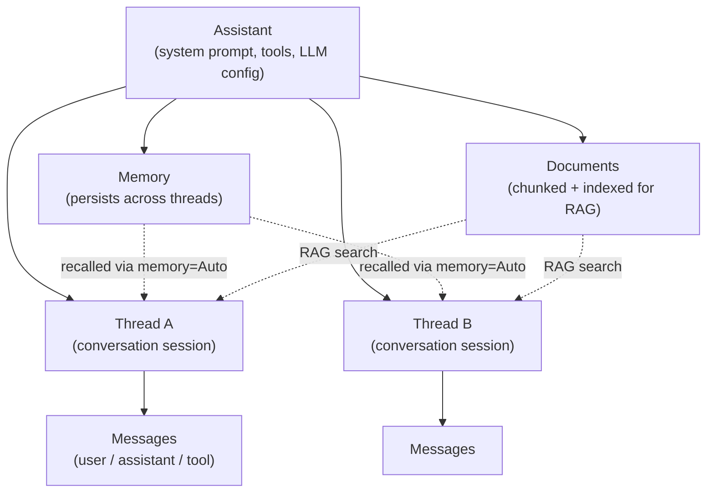

<p align="right">
  <a href=".cursor/skills/backboard-app/SKILL.md"></a>
  <a href="CLAUDE.md"></a>
</p>

<p align="center">
  
</p>

<h1 align="center">Cookbook</h1>

<p align="center">
  Proven patterns for building with <a href="https://backboard.io">backboard.io</a> -- extracted from production codebases so you can copy, paste, and ship.
</p>

## What is Backboard?

Backboard is an API for building AI applications. It gives you:

- **Assistants** -- AI agents with a system prompt, tools, and an LLM behind them
- **Threads** -- persistent conversation sessions attached to an assistant
- **Messages** -- send user messages, get assistant responses (streaming or not)
- **Memory** -- semantic long-term memory that persists across threads
- **Documents** -- upload files for automatic chunking, indexing, and RAG

You talk to one API. It handles LLM routing, vector storage, document processing, and conversation state.

## How It All Fits Together



## Getting Started

```bash
pip install backboard-sdk
```

Set your API key:

```bash
export BACKBOARD_API_KEY="your-key-here"
```

Pick a recipe from the table below, read the doc, copy the code.

**Before you ship, read [Common Pitfalls](docs/00-pitfalls.md)** -- especially the rules on per-user assistant isolation and awaiting memory operations.

## Recipes

### Python

| # | Recipe | Pattern | Difficulty | Doc | Code |
|---|--------|---------|------------|-----|------|
| 1 | Hello Backboard | First message | Beginner | [doc](docs/01-hello-backboard.md) | [code](recipes/hello_backboard.py) |
| 2 | Memory as Storage | Memory as app storage | Beginner | [doc](docs/02-memory-as-storage.md) | [code](recipes/memory_as_storage.py) |
| 3 | Tool Calling | Tool-calling assistant | Intermediate | [doc](docs/03-tool-calling.md) | [code](recipes/tool_calling.py) |
| 4 | Streaming Chat | Streaming responses | Intermediate | [doc](docs/04-streaming-chat.md) | [code](recipes/streaming_chat.py) |
| 5 | Document RAG | Document upload + RAG | Intermediate | [doc](docs/05-document-rag.md) | [code](recipes/document_rag.py) |
| 6 | Multi-Assistant | Multi-assistant architecture | Intermediate | [doc](docs/06-multi-assistant.md) | [code](recipes/multi_assistant.py) |
| 7 | LLM Data Processor | LLM as data processor | Intermediate | [doc](docs/07-llm-data-processor.md) | [code](recipes/llm_data_processor.py) |
| 8 | Cross-Thread Memory | Cross-conversation memory | Beginner | [doc](docs/08-cross-thread-memory.md) | [code](recipes/cross_thread_memory.py) |

### TypeScript

| # | Recipe | Pattern | Difficulty | Doc | Code |
|---|--------|---------|------------|-----|------|
| 9 | Custom Client | Custom HTTP client | Intermediate | [doc](docs/09-ts-client.md) | [code](recipes/ts_client.ts) |
| 10 | Storage Abstraction | Memory as a database | Intermediate | [doc](docs/10-ts-storage-abstraction.md) | [code](recipes/ts_storage_abstraction.ts) |
| 11 | OpenAI Proxy | OpenAI-compatible proxy | Advanced | [doc](docs/11-ts-openai-proxy.md) | [code](recipes/ts_openai_proxy.ts) |
| 12 | Per-User Isolation | Per-user data isolation | Advanced | [doc](docs/12-ts-per-user-isolation.md) | [code](recipes/ts_per_user_isolation.ts) |
| 13 | Agent Sync | Entity-to-assistant mapping | Intermediate | [doc](docs/13-ts-agent-sync.md) | [code](recipes/ts_agent_sync.ts) |

## Concepts Quick Reference

| Concept | What it is | API |
|---------|-----------|-----|
| **Assistant** | An AI agent with a system prompt, tools, and LLM config | `create_assistant()`, `list_assistants()` |
| **Thread** | A conversation session tied to an assistant | `create_thread(assistant_id)` |
| **Message** | A user, assistant, or tool message in a thread | `add_message(thread_id, content)` |
| **Memory** | Semantic facts stored on an assistant, searchable across threads | `add_memory()`, `get_memories()` |
| **Document** | An uploaded file, chunked and indexed for RAG | `upload_document_to_assistant()` |
| **Tool** | A function the assistant can call; you execute it and return results | `submit_tool_outputs()` |
| **Run** | An LLM execution triggered by a message; identified by `run_id` | returned in message response |

## AI Editor Integration

This repo includes agent instructions so Cursor and Claude Code know how to write correct Backboard code.

| Editor | File | Scope |
|--------|------|-------|
| **Cursor** | `.cursor/skills/backboard-app/SKILL.md` | Auto-loaded when working in this repo |
| **Claude Code** | `CLAUDE.md` | Auto-loaded when working in this repo |

To use in **any** project, copy the skill to your personal directory:

```bash
# Cursor
cp -r .cursor/skills/backboard-app ~/.cursor/skills/

# Claude Code
cp CLAUDE.md ~/your-project/CLAUDE.md
```

## Where These Patterns Come From

Every recipe is extracted from real production code:

- **TopicMiner.io** -- AI video content mining (tool calling, segmentation, multi-assistant)
- **BattleBoard.io** -- WebGL tactics game (tool calling, force generation, structured storage)
- **marketplace.backboard.io** -- App marketplace (memory storage, tag generation)
- **newsboard.backboard.io** -- News app with LLM categorization (data processing, model caching)
- **Nash.backboard.io** -- Full chat platform (custom client, OpenAI proxy, per-user isolation, agent sync)
