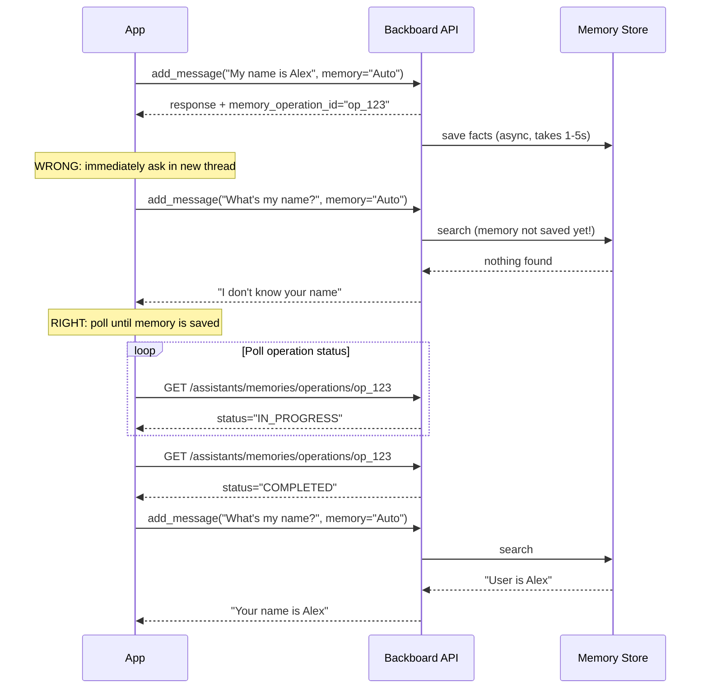

<p align="right"></p>

# Common Pitfalls

> Read this before you ship. These are the mistakes that break production apps.

## 1. Per-user assistant isolation is mandatory

**Severity: Critical -- data leaks between users**

Memories created via `memory="Auto"` are stored on the assistant the thread belongs to. If all your users share one assistant, every user's memories are visible to every other user. User A says "My SSN is 123-45-6789" and User B asks "What do you know?" -- the assistant happily recalls it.

**The rule:** user data = per-user assistant, no exceptions.

```python
# WRONG -- shared assistant for all users
assistant_id = "asst_shared_for_everyone"
thread = await client.create_thread(assistant_id)
await client.add_message(thread.thread_id, content, memory="Auto")
# Every user's facts land on the same assistant and are recalled for everyone
```

```python
# RIGHT -- per-user assistant
async def get_user_assistant(client, user_id: str) -> str:
    name = f"myapp-user-{user_id}"
    assistants = await client.list_assistants()
    for a in assistants:
        if a.name == name:
            return a.assistant_id
    assistant = await client.create_assistant(name=name, system_prompt="...")
    return assistant.assistant_id

assistant_id = await get_user_assistant(client, current_user.id)
thread = await client.create_thread(assistant_id)
await client.add_message(thread.thread_id, content, memory="Auto")
# Memories are scoped to this user's assistant only
```

A shared assistant is fine for app-level config, model listings, or shared knowledge bases. But the moment you create a thread on it with `memory="Auto"`, every user's facts get stored there and retrieved for every other user.

**Bright-line rule:** shared assistant = shared data only. User data = per-user assistant.

See [Recipe 12: Per-User Isolation](12-ts-per-user-isolation.md) for the full pattern with caching and debounced writes.

---

## 2. `memory="Auto"` is asynchronous -- you must await it

**Severity: Critical -- silent data loss between requests**

After the LLM finishes, Backboard saves memories in a background task. The response includes a `memory_operation_id`. If you immediately send a follow-up in a new thread, the memory may not exist yet.



**Poll the memory operation before proceeding:**

```python
async def wait_for_memory(client, operation_id: str, timeout: float = 30.0):
    """Poll until a memory operation completes. Raise on failure or timeout."""
    import time
    start = time.time()
    while time.time() - start < timeout:
        status = await client.get_memory_operation_status(operation_id)
        if status.status == "COMPLETED":
            return status
        if status.status == "FAILED":
            raise RuntimeError(f"Memory operation {operation_id} failed")
        await asyncio.sleep(1)
    raise TimeoutError(f"Memory operation {operation_id} timed out after {timeout}s")

# Usage
response = await client.add_message(thread_id, content, memory="Auto", stream=False)
if response.memory_operation_id:
    await wait_for_memory(client, response.memory_operation_id)
# Now it's safe to use memories in a new thread
```

A `time.sleep(3)` works for demos but is unreliable in production. Operations can take longer under load, and sleeping a fixed amount wastes time when they're fast.

See [Recipe 8: Cross-Thread Memory](08-cross-thread-memory.md) for the full pattern.

---

## 3. `getMemories()` returns everything -- filter aggressively

**Severity: High -- LLM context pollution and broken UIs**

If you store app data as memories (conversations, settings, game saves) alongside `memory="Auto"` on the same assistant, `get_memories()` returns all of it mixed together. Your "Memories" UI shows raw JSON blobs. Your LLM context gets flooded with serialized metadata instead of real user facts.

**Always filter by `metadata.type`:**

```python
all_memories = await client.get_memories(assistant_id)

# Filter to only the type you want
todos = [
    m for m in all_memories.memories
    if (m.metadata or {}).get("type") == "todo"
]
```

**Establish your type convention on day one** -- e.g., `myapp_convo`, `myapp_msg`, `myapp_setting`. Without it, everything bleeds together.

See [Recipe 2: Memory as Storage](02-memory-as-storage.md) and [Recipe 10: Storage Abstraction](10-ts-storage-abstraction.md) for the full pattern.

---

## 4. Don't trust the shared assistant for anything user-specific

**Severity: High -- same root cause as pitfall 1**

This is worth restating separately because it comes up in a different context: you create a "shared" assistant for app-level data (model listings, default configs, folder contexts). That's fine. But if you ever create a thread on it with `memory="Auto"` for a user-facing chat, you've just made every user's memories shared.

| Assistant type | `memory="Auto"` safe? | Use for |
|---------------|----------------------|---------|
| **Per-user** (`myapp-user-{id}`) | Yes | Chat, user preferences, personal context |
| **Shared app** (`myapp`) | No | App config, model cache, shared knowledge base |
| **Shared folder** (`myapp-folder-{id}`) | Depends | Only if all users in the folder should share context |

In Nash/LibreChat, folder chats explicitly set `memory="Off"` when using a shared assistant to prevent cross-user contamination.

<p align="center"></p>
