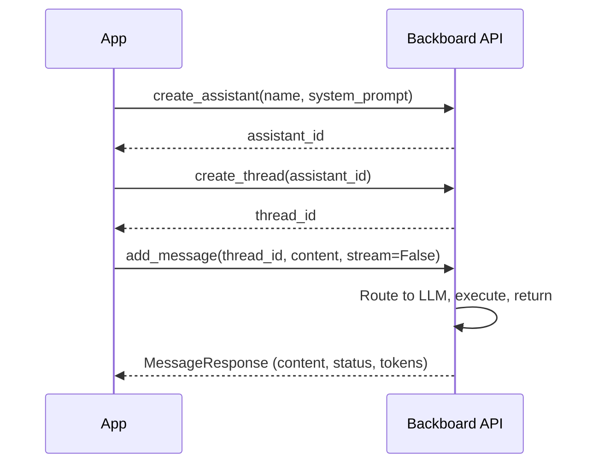

<p align="right"></p>

# Recipe 1: Hello Backboard

> **Python** | **Beginner** | [View Code](../recipes/hello_backboard.py)

Create an assistant, start a thread, send a message, and get a response. This is the minimum viable Backboard interaction.

## When to Use This

- You're starting a new project and need to verify your API key works
- You want the simplest possible example of talking to an LLM via Backboard
- You need a quick template to build on top of

## Concepts

| Concept | Role in this recipe |
|---------|-------------------|
| **Assistant** | The AI agent that processes your messages |
| **Thread** | A conversation session; holds message history |
| **Message** | Your input and the assistant's response |

## Flow



## The Code

```python
client = get_client()

# Step 1: Create (or reuse) an assistant
assistant_id = await get_or_create_assistant(
    client,
    name="Cookbook Hello",
    system_prompt="You are a helpful assistant. Keep answers brief.",
)

# Step 2: Create a thread (a conversation session)
thread = await client.create_thread(assistant_id)

# Step 3: Send a message and get a response
response = await client.add_message(
    thread_id=thread.thread_id,
    content="What are three things every developer should know?",
    stream=False,
)

print(response.content)
```

## Step by Step

1. **`get_client()`** reads `BACKBOARD_API_KEY` from the environment and creates a `BackboardClient`.

2. **`get_or_create_assistant()`** checks if an assistant named "Cookbook Hello" already exists. If so, it reuses it. Otherwise it creates one with the given system prompt. This is idempotent -- you can run the recipe many times without creating duplicate assistants.

3. **`create_thread(assistant_id)`** creates a new conversation session. Each thread is independent -- messages in one thread don't affect another.

4. **`add_message(thread_id, content, stream=False)`** sends your message to the assistant. With `stream=False`, you get the complete response back in one shot. The response includes:
   - `content` -- the assistant's text response
   - `status` -- `"COMPLETED"` when the LLM finished normally
   - `model_provider` / `model_name` -- which LLM handled the request
   - `total_tokens` -- total token usage

## Gotchas

- **Assistants are persistent.** Creating one with the same name twice gives you two assistants. Use `get_or_create_assistant()` (the `_common.py` helper) to avoid duplicates.
- **Threads accumulate.** Each `create_thread()` creates a new conversation. In production, reuse thread IDs for ongoing conversations and create new ones for fresh sessions.
- **Default model.** If you don't specify `llm_provider` and `model_name` on `add_message()`, the Backboard API picks a default. You can override with e.g. `llm_provider="anthropic"`, `model_name="claude-sonnet-4-20250514"`.

<p align="center" style="padding-top: 2em; padding-bottom: 2em;"></p>
