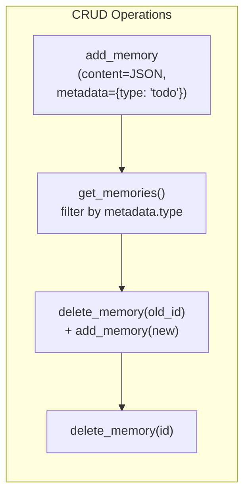
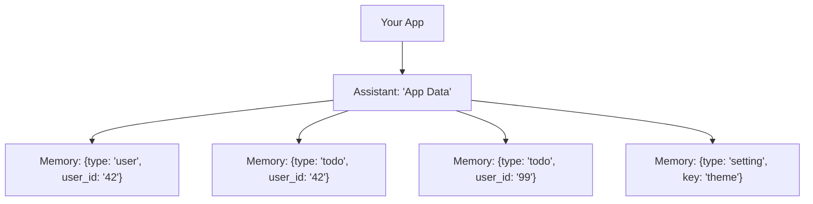

<p align="right"></p>

# Recipe 2: Memory as App Storage

> **Python** | **Beginner** | [View Code](../recipes/memory_as_storage.py)

Use Backboard memories as a structured key-value store. Store JSON in `content`, use `metadata.type` for filtering. Full CRUD without a database.

## When to Use This

- You need persistent storage but don't want to run a database
- Your app stores structured entities (users, items, settings, game saves)
- You want to scope data per-user or per-entity using metadata fields

## Concepts

| Concept | Role in this recipe |
|---------|-------------------|
| **Assistant** | The "database" -- memories are scoped to an assistant |
| **Memory** | A single record: `content` (your data) + `metadata` (your indexes) |

## Flow





## The Code

### Create

```python
todo = {"title": "Buy groceries", "done": False, "priority": "high"}
result = await client.add_memory(
    assistant_id=assistant_id,
    content=json.dumps(todo),
    metadata={"type": "todo", "title": todo["title"]},
)
todo_id = result.id
```

### Read (list + filter)

```python
all_memories = await client.get_memories(assistant_id)
todos = [
    m for m in all_memories.memories
    if (m.metadata or {}).get("type") == "todo"
]
for t in todos:
    data = json.loads(t.content)
    print(f"{data['title']} done={data['done']}")
```

### Update (delete + re-create)

```python
await client.delete_memory(assistant_id=assistant_id, memory_id=todo_id)
new_result = await client.add_memory(
    assistant_id=assistant_id,
    content=json.dumps(updated_todo),
    metadata={"type": "todo", "title": updated_todo["title"]},
)
```

### Delete

```python
await client.delete_memory(assistant_id=assistant_id, memory_id=todo_id)
```

### Find by metadata

```python
user_todos = [
    m for m in all_memories.memories
    if (m.metadata or {}).get("type") == "todo"
    and (m.metadata or {}).get("user_id") == "user_42"
]
```

## Step by Step

1. **Choose your `metadata.type` convention.** Every entity type gets a string tag: `"todo"`, `"user"`, `"setting"`, etc. This is how you filter.

2. **Store data as JSON in `content`.** The content field is a string -- serialize your objects with `json.dumps()`.

3. **Add indexable fields to `metadata`.** Anything you need to filter or look up goes in metadata: `user_id`, `title`, `category`, etc.

4. **Filter client-side.** `get_memories()` returns all memories for an assistant. Filter the list in your code by checking metadata fields.

5. **Update = delete + create.** Memories are immutable. To update, delete the old one and create a new one. Save the new ID.

## Gotchas

- **No server-side filtering.** `get_memories()` returns everything. If you have thousands of memories on one assistant, consider splitting across multiple assistants (see Recipe 6: Multi-Assistant).
- **Update is not atomic.** The delete-then-create pattern means there's a brief window where the data doesn't exist. In production, create the new memory first, then delete the old one (write-first pattern) to avoid data loss.
- **Content size limit.** Memory content has a size limit (~50KB). For large objects, split into multiple memories or use documents instead.
- **IDs change on update.** Since update is delete + create, the memory ID changes. If you cache IDs, update your cache.

<br />
<br />
<br />
<p align="center" style="padding-top: 2em; padding-bottom: 2em;"></p>
