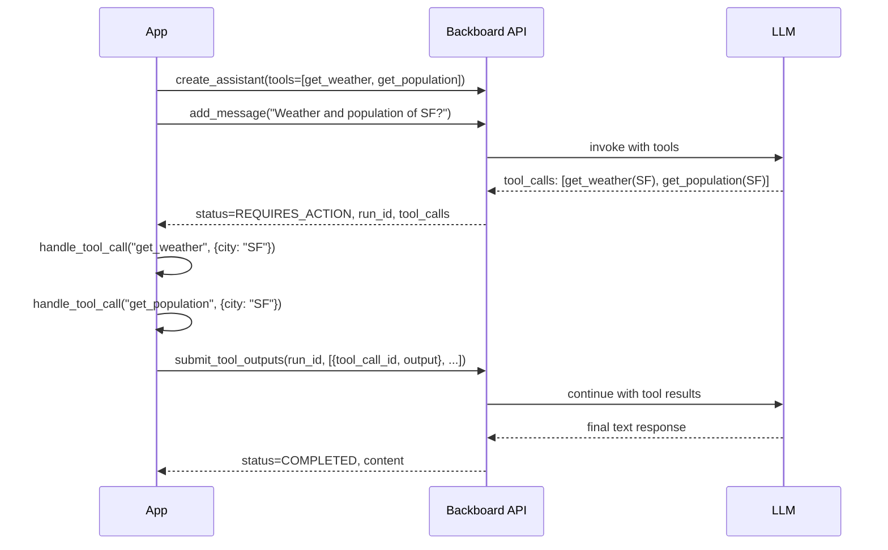

<p align="right"></p>

# Recipe 3: Tool-Calling Assistant

> **Python** | **Intermediate** | [View Code](../recipes/tool_calling.py)

Define function tools on an assistant, detect `REQUIRES_ACTION`, execute your tool handler, submit outputs, and loop until the LLM is done.

## When to Use This

- Your assistant needs to take actions (query a database, call an API, control hardware)
- You want the LLM to decide *when* to use a tool based on user input
- You're building an agent that chains multiple tool calls together

## Concepts

| Concept | Role in this recipe |
|---------|-------------------|
| **Assistant** | Configured with a `tools` array defining available functions |
| **Tool** | A function spec (name, description, parameters) the LLM can invoke |
| **Run** | An LLM execution; identified by `run_id` when tool outputs are needed |
| **REQUIRES_ACTION** | Status returned when the LLM wants to call your tools |
| **submit_tool_outputs** | How you send tool results back to continue the run |

## Flow



## The Code

### 1. Define tools

```python
TOOLS = [
    {
        "type": "function",
        "function": {
            "name": "get_weather",
            "description": "Get current weather for a city",
            "parameters": {
                "type": "object",
                "properties": {
                    "city": {"type": "string", "description": "City name"},
                    "units": {
                        "type": "string",
                        "enum": ["celsius", "fahrenheit"],
                    },
                },
                "required": ["city"],
            },
        },
    },
]
```

### 2. Implement the tool handler

```python
def handle_tool_call(name: str, args: dict) -> str:
    if name == "get_weather":
        return json.dumps({"temperature": 72, "condition": "sunny"})
    return json.dumps({"error": f"Unknown tool: {name}"})
```

### 3. The tool-calling loop

```python
response = await client.add_message(
    thread_id=thread.thread_id,
    content="What's the weather in San Francisco?",
    stream=False,
)

while response.status == "REQUIRES_ACTION" and response.tool_calls:
    tool_outputs = []
    for tc in response.tool_calls:
        args = tc.function.parsed_arguments
        result = handle_tool_call(tc.function.name, args)
        tool_outputs.append({
            "tool_call_id": tc.id,
            "output": result,
        })

    response = await client.submit_tool_outputs(
        thread_id=thread.thread_id,
        run_id=response.run_id,
        tool_outputs=tool_outputs,
    )

print(response.content)
```

## Step by Step

1. **Define tools in OpenAI function-calling format.** Each tool has a `name`, `description`, and JSON Schema `parameters`. These are passed to `create_assistant(tools=...)`.

2. **Send a message.** When the LLM determines it needs a tool, the response comes back with `status="REQUIRES_ACTION"` and a `tool_calls` array.

3. **Process each tool call.** Each tool call has an `id`, a `function.name`, and `function.parsed_arguments` (already parsed from JSON). Dispatch to your handler.

4. **Return results as JSON strings.** Tool outputs must be JSON-serialized strings. Each output is paired with its `tool_call_id`.

5. **Submit and loop.** `submit_tool_outputs()` sends results back. The LLM may respond with more tool calls (chaining) or a final text response. Keep looping until `status != "REQUIRES_ACTION"`.

## Gotchas

- **Always return JSON strings.** The `output` field in tool outputs must be a string, not a dict. Use `json.dumps()`.
- **Handle all tool calls.** If the LLM requests multiple tools in one round, you must return outputs for all of them in a single `submit_tool_outputs()` call.
- **The loop can run multiple rounds.** The LLM might call tools, get results, then call more tools based on those results. The `while` loop handles this.
- **Tool errors are tool outputs.** If a tool fails, return a JSON error message as the output. Don't raise an exception -- let the LLM decide how to handle it.
- **`run_id` is per-round.** Each `submit_tool_outputs()` uses the `run_id` from the response that triggered it.

<p align="center"></p>
