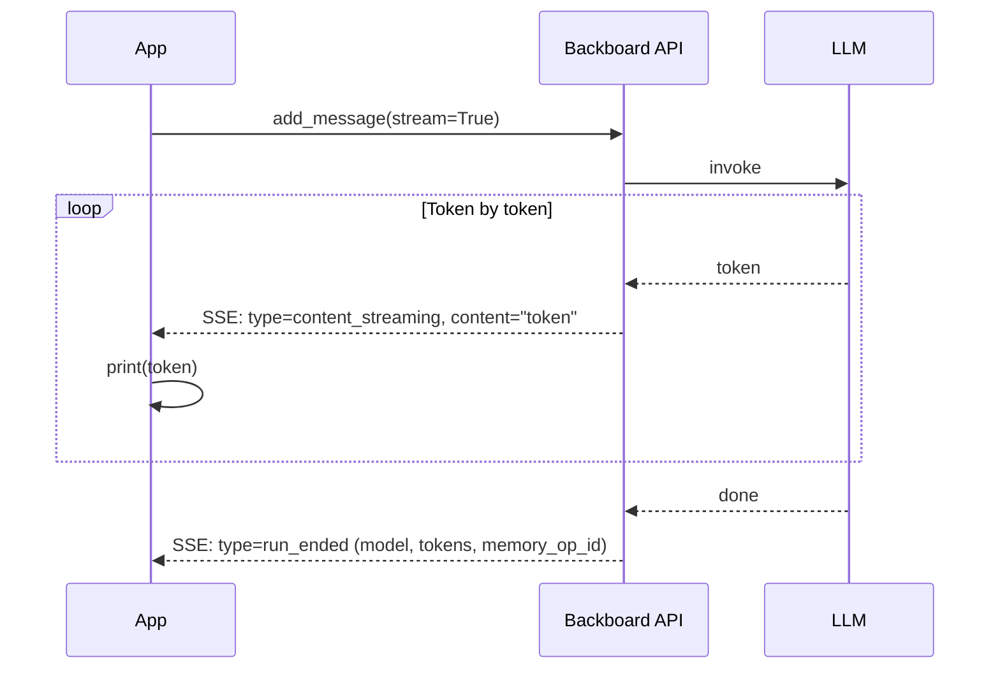

<p align="right"></p>

# Recipe 4: Streaming Chat

> **Python** | **Intermediate** | [View Code](../recipes/streaming_chat.py)

Stream LLM responses token-by-token as they arrive. Handle `content_streaming`, `run_ended`, and error events.

## When to Use This

- You're building a chat UI that needs to show text as it's generated
- You want lower time-to-first-token for a better user experience
- You need to process events (memory operations, errors) as they happen

## Concepts

| Concept | Role in this recipe |
|---------|-------------------|
| **Streaming** | `add_message(stream=True)` returns an async iterator of SSE events |
| **content_streaming** | Event type containing a chunk of response text |
| **run_ended** | Event type signaling the LLM run is complete, with metadata |

## Flow



## The Code

```python
async for chunk in await client.add_message(
    thread_id=thread.thread_id,
    content="Explain how a hash table works.",
    stream=True,
):
    event_type = chunk.get("type")

    if event_type == "content_streaming":
        token = chunk.get("content", "")
        if token:
            print(token, end="", flush=True)

    elif event_type == "run_ended":
        print(f"\nModel: {chunk.get('model_provider')}/{chunk.get('model_name')}")
        print(f"Tokens: {chunk.get('total_tokens')}")

    elif event_type in ("error", "run_failed"):
        print(f"Error: {chunk.get('error') or chunk.get('message')}")
        break
```

## Step by Step

1. **Call `add_message(stream=True)`.** This returns an async iterator. Each iteration yields a dict with a `type` field.

2. **Handle `content_streaming`.** These events carry a small `content` string -- typically a few tokens. Print or buffer them as they arrive.

3. **Handle `run_ended`.** This fires once at the end. It contains metadata: `model_provider`, `model_name`, `input_tokens`, `output_tokens`, `total_tokens`, and optionally `memory_operation_id`.

4. **Handle errors.** Events with type `error` or `run_failed` contain an `error` or `message` field. Break out of the loop on these.

## Event Types Reference

| Event Type | Fields | When |
|-----------|--------|------|
| `content_streaming` | `content` | Each token/chunk of the response |
| `run_ended` | `model_provider`, `model_name`, `input_tokens`, `output_tokens`, `total_tokens`, `memory_operation_id` | LLM finished |
| `tool_submit_required` | `run_id`, `tool_calls` | LLM wants to call tools (see Recipe 3) |
| `error` | `error` | Something went wrong |
| `run_failed` | `message` | The run failed |

## Gotchas

- **`flush=True` matters.** Without it, output buffers and the streaming effect is lost.
- **The iterator is async.** Use `async for`, not `for`. The SDK yields events as they arrive from the SSE stream.
- **Streaming + tools.** When streaming a tool-calling assistant, you get `tool_submit_required` events instead of `REQUIRES_ACTION` status. The `tool_calls` are in the event payload. See the SDK docs for the streaming tool-call pattern.
- **Memory operations are async.** The `memory_operation_id` in `run_ended` tells you a background memory save is happening. You can poll its status if you need to confirm it completed.
- **Don't assume one `run_ended`.** In complex flows (tool calls + resume), you may see multiple runs. Each has its own `run_ended`.

<br />
<br />
<br />
<p align="center" style="padding-top: 2em; padding-bottom: 2em;"></p>
