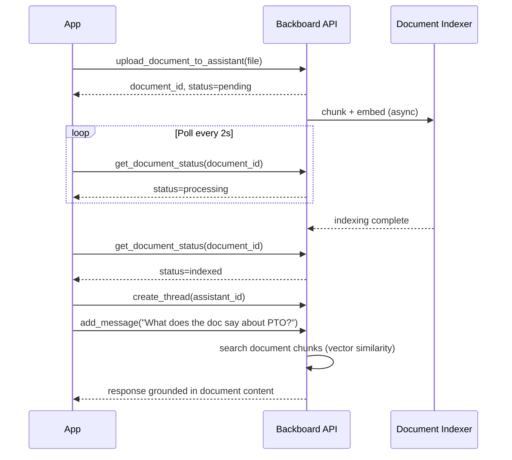
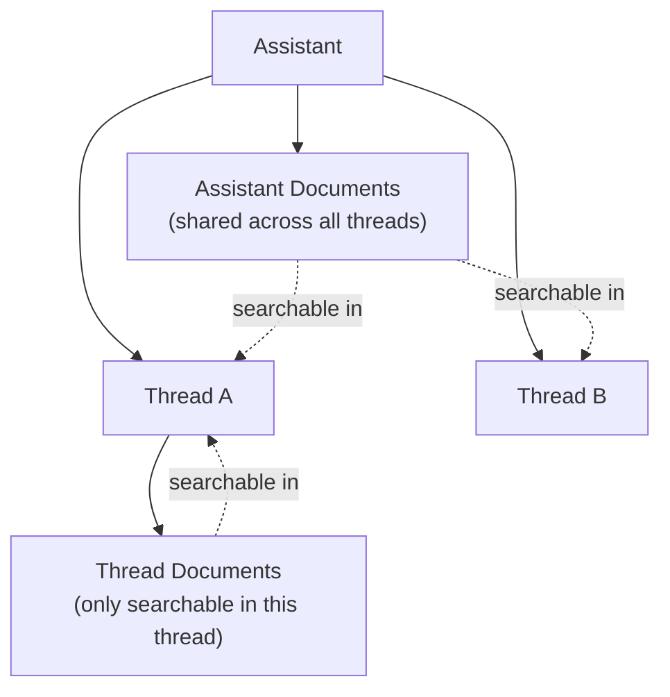

<p align="right"></p>

# Recipe 5: Document RAG

> **Python** | **Intermediate** | [View Code](../recipes/document_rag.py)

Upload a document to an assistant, poll until it's indexed, then ask questions about its contents. Backboard handles chunking, embedding, and retrieval automatically.

## When to Use This

- You need your assistant to answer questions grounded in specific documents
- You're building a knowledge base, help desk, or document Q&A feature
- You want RAG without managing vector databases or embedding pipelines yourself

## Concepts

| Concept | Role in this recipe |
|---------|-------------------|
| **Document** | An uploaded file that gets chunked and indexed for search |
| **Document Status** | Lifecycle: `pending` -> `processing` -> `indexed` (or `error`) |
| **RAG** | The assistant automatically searches indexed documents when answering |
| **Document Scope** | Assistant-level (shared across all threads) or thread-level (one thread only) |

## Flow



## The Code

### Upload and poll

```python
# Upload a document
doc = await client.upload_document_to_assistant(
    assistant_id=assistant_id,
    filename="handbook.md",
    file_content=SAMPLE_DOCUMENT.encode("utf-8"),
)

# Poll until indexed
while True:
    status = await client.get_document_status(doc.document_id)
    if status.status == "indexed":
        break
    if status.status == "error":
        print(f"Error: {status.status_message}")
        return
    time.sleep(2)
```

### Query the document

```python
thread = await client.create_thread(assistant_id)
response = await client.add_message(
    thread_id=thread.thread_id,
    content="How many PTO days do employees get?",
    stream=False,
)
print(response.content)
```

## Step by Step

1. **Upload the document.** Use `upload_document_to_assistant()` for documents that should be searchable across all threads, or `upload_document_to_thread()` for thread-scoped documents.

2. **Poll for indexing.** Document processing is async. The status goes `pending` -> `processing` -> `indexed`. Poll `get_document_status()` every 2-3 seconds until it's `indexed` or `error`.

3. **Ask questions.** Once indexed, any message to a thread on that assistant will automatically search the document. You don't need to do anything special -- the assistant's built-in `search_documents` tool handles it.

4. **Supported formats.** Backboard processes PDF, Office docs (docx, xlsx, pptx), plain text, Markdown, CSV, JSON, and code files.

## Document Scopes



- **Assistant-level:** `upload_document_to_assistant()` -- available to all threads. Use for shared knowledge bases.
- **Thread-level:** `upload_document_to_thread()` -- available only in that thread. Use for per-conversation uploads.

## Gotchas

- **Indexing takes time.** Small files take a few seconds, large PDFs can take 30+ seconds. Don't query before indexing is complete.
- **No partial results.** A document is either fully indexed or not searchable at all.
- **File size limits.** Check the current limits in the Backboard docs. Very large files may need to be split.
- **Deleting documents.** Use `delete_document(document_id)` to remove. The document is removed from search results immediately.

<br />
<br />
<br />
<p align="center" style="padding-top: 2em; padding-bottom: 2em;"></p>
