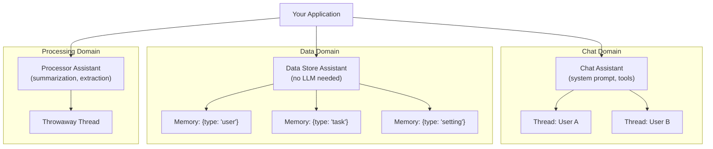

<p align="right"></p>

# Recipe 6: Multi-Assistant Architecture

> **Python** | **Intermediate** | [View Code](../recipes/multi_assistant.py)

Use separate assistants for different concerns in your app. One for chat, one for data, one for specialized tasks. This is the "assistant per domain" pattern.

## When to Use This

- Your app has distinct responsibilities (chat, data storage, content generation)
- You want to isolate memories and documents between different concerns
- You need different system prompts or tools for different tasks
- Your data store is growing large and you want to shard by responsibility

## Concepts

| Concept | Role in this recipe |
|---------|-------------------|
| **Assistant** | Each assistant is a separate domain with its own memories, documents, and config |
| **Memory isolation** | Memories on one assistant are invisible to another |
| **System prompt** | Each assistant has a specialized prompt for its role |

## Flow



## The Code

### Create domain-specific assistants

```python
chat_assistant_id = await get_or_create_assistant(
    client,
    name="Cookbook Chat",
    system_prompt="You are a helpful project management assistant.",
    tools=[...],
)

data_assistant_id = await get_or_create_assistant(
    client,
    name="Cookbook Data Store",
    system_prompt="Data storage assistant.",
)

processor_assistant_id = await get_or_create_assistant(
    client,
    name="Cookbook Processor",
    system_prompt="You produce concise one-sentence summaries.",
)
```

### Store data on the data assistant

```python
await client.add_memory(
    assistant_id=data_assistant_id,
    content=json.dumps(task),
    metadata={"type": "task", "user_id": "u1"},
)
```

### Read data from the data assistant

```python
all_memories = await client.get_memories(data_assistant_id)
user_tasks = [
    json.loads(m.content) for m in all_memories.memories
    if (m.metadata or {}).get("type") == "task"
    and (m.metadata or {}).get("user_id") == "u1"
]
```

### Use the processor for one-off LLM tasks

```python
thread = await client.create_thread(processor_assistant_id)
response = await client.add_message(
    thread_id=thread.thread_id,
    content=f"Summarize these tasks:\n{task_text}",
    stream=False,
)
```

## Step by Step

1. **Identify your domains.** Most apps have 2-3: a chat/interaction domain, a data storage domain, and optionally a processing domain for LLM-powered tasks.

2. **Create one assistant per domain.** Each gets its own name, system prompt, and tools. Use `get_or_create_assistant()` to make it idempotent.

3. **Use the data assistant for storage only.** Don't send chat messages to it -- just use `add_memory()` / `get_memories()`. It's your database.

4. **Use the processor for throwaway tasks.** Create temporary threads, send a prompt, get a result, discard the thread. The processor's system prompt is tuned for the task (summarization, classification, etc.).

5. **Keep the chat assistant focused.** Its system prompt and tools are about user interaction. Data fetching happens through your code, not through the chat assistant's memory.

## When to Split vs. Keep Together

| Scenario | Recommendation |
|----------|---------------|
| Small app, < 100 memories | One assistant is fine |
| Memories growing past ~1000 | Split data into its own assistant |
| Multiple LLM tasks with different prompts | Separate processor assistants |
| Per-user isolation needed | One assistant per user (see Recipe 12) |
| Different tools for different contexts | Separate assistants per tool set |

## Gotchas

- **Memories don't cross assistants.** A memory on the data assistant is not searchable from the chat assistant's threads. This is a feature (isolation), not a bug.
- **Assistant IDs must be tracked.** Store them as constants or use `get_or_create_assistant()` to look them up by name.
- **More assistants = more API calls.** Each assistant is a separate scope. If you need data from multiple assistants, that's multiple `get_memories()` calls.

<br />
<br />
<br />
<p align="center" style="padding-top: 2em; padding-bottom: 2em;"></p>
