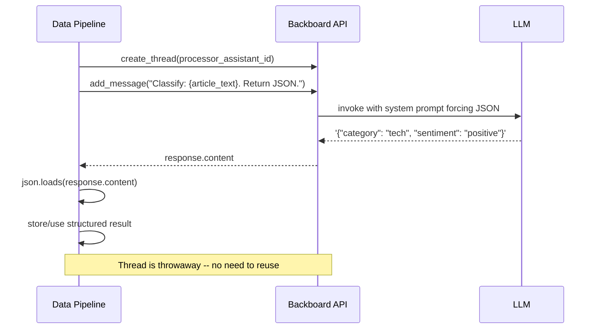

# Recipe 7: LLM Data Processor

> **Python** | **Intermediate** | [View Code](../recipes/llm_data_processor.py)

Use throwaway threads to run structured data extraction, classification, or transformation tasks. Not chat -- this is LLM-as-a-function.

## When to Use This

- You need to classify, tag, or categorize data using an LLM
- You want to extract structured fields from unstructured text
- You need summarization, translation, or reformatting as a data pipeline step
- The task is one-shot (no conversation needed)

## Concepts

| Concept | Role in this recipe |
|---------|-------------------|
| **Assistant** | Configured with a system prompt that forces structured output |
| **Thread** | Throwaway -- created per task, discarded after |
| **System prompt** | Instructs the LLM to return only JSON, no explanation |

## Flow




## The Code

### The processor function

```python
async def classify_article(client, assistant_id: str, article: dict) -> dict:
    thread = await client.create_thread(assistant_id)

    response = await client.add_message(
        thread_id=thread.thread_id,
        content=(
            f"Classify this article. Return ONLY valid JSON with keys: "
            f"category, sentiment, tags.\n\n"
            f"Title: {article['title']}\n"
            f"Body: {article['body']}"
        ),
        stream=False,
    )

    # Strip markdown code fences if present
    text = response.content.strip()
    if text.startswith("```"):
        text = text.split("\n", 1)[1].rsplit("```", 1)[0].strip()

    return json.loads(text)
```

### The system prompt

```python
assistant_id = await get_or_create_assistant(
    client,
    name="Cookbook Classifier",
    system_prompt=(
        "You are a data classification engine. You receive articles and return "
        "structured JSON classifications. Return ONLY valid JSON, no explanation."
    ),
)
```

## Step by Step

1. **Create a dedicated processor assistant.** The system prompt should explicitly say "return ONLY valid JSON" or similar. The more specific, the more reliable.

2. **Create a fresh thread per task.** Each classification is independent -- no conversation history needed.

3. **Prompt with the data and desired schema.** Specify the exact keys and valid values in the prompt. The more constrained, the better.

4. **Parse the response.** LLMs sometimes wrap JSON in markdown code fences. Strip those before parsing.

5. **Handle parse failures.** Wrap `json.loads()` in a try/except. If parsing fails, you can retry or log the raw response.

## Prompt Engineering Tips

| Tip | Example |
|-----|---------|
| Specify exact keys | `"Return JSON with keys: category, sentiment, tags"` |
| Constrain values | `"category must be one of: tech, business, sports"` |
| Say "ONLY" | `"Return ONLY valid JSON, no explanation"` |
| Give an example | `"Example: {\"category\": \"tech\", \"sentiment\": \"positive\"}"` |
| Set it in the system prompt | Put the format constraints in the system prompt, not just the user message |

## Gotchas

- **LLMs add markdown fences.** Even when told not to, LLMs often wrap JSON in ` ```json ... ``` `. Always strip these.
- **Thread-per-task is fine.** Don't try to reuse threads for unrelated classification tasks -- conversation history can confuse the output.
- **Model choice matters.** Faster/cheaper models (GPT-4o-mini, Claude Haiku) work well for classification. Use `llm_provider` and `model_name` params to pick.
- **Batch carefully.** You can classify multiple items in one prompt, but parsing becomes harder. One item per thread is more reliable.
- **Token costs add up.** Each classification uses tokens. For high-volume pipelines, consider batching or using the cheapest model that works.
