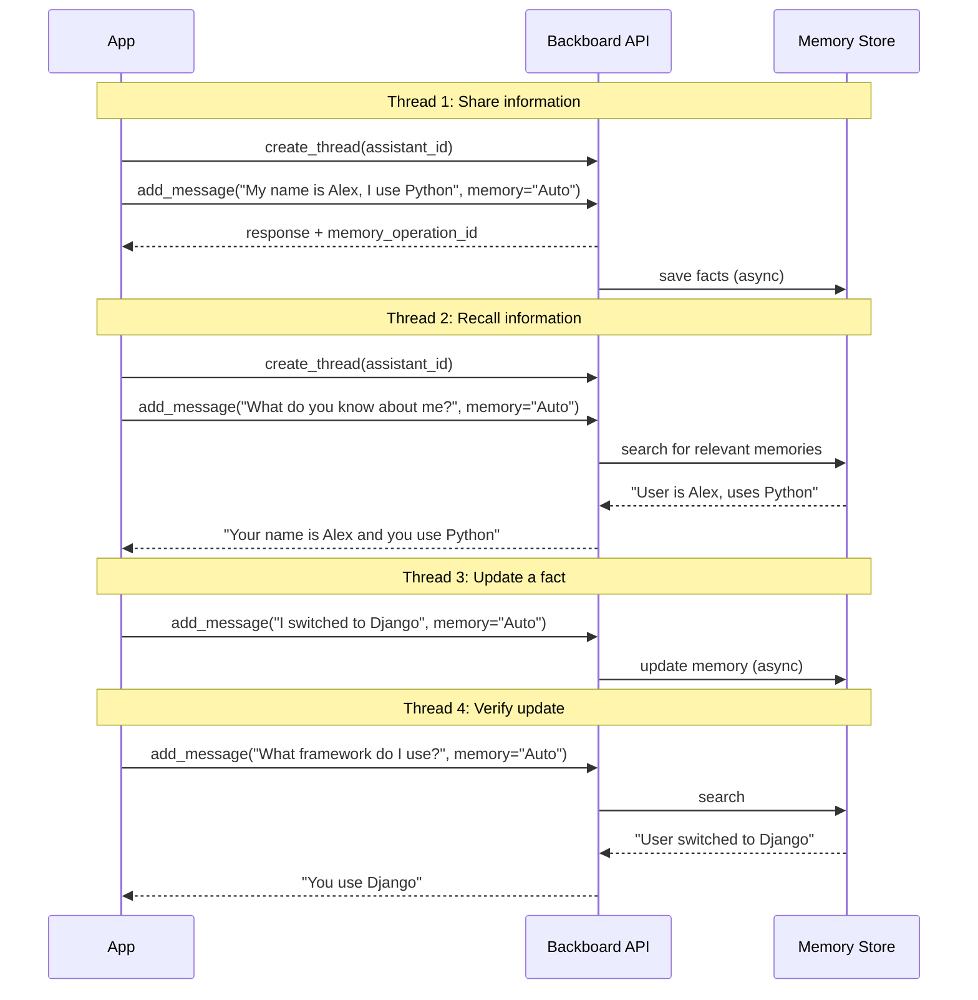

<p align="right"></p>

# Recipe 8: Cross-Thread Memory

> **Python** | **Beginner** | [View Code](../recipes/cross_thread_memory.py)

Use `memory="Auto"` to persist facts across conversations. Information shared in one thread is recalled in a completely different thread.

> **Warning: In multi-user apps, you must use a per-user assistant.**
> Memories are stored on the assistant, not the thread. If multiple users share one assistant with `memory="Auto"`, every user's facts are visible to every other user. See [Pitfall 1](00-pitfalls.md#1-per-user-assistant-isolation-is-mandatory) and [Recipe 12: Per-User Isolation](12-ts-per-user-isolation.md).

## When to Use This

- Your assistant should remember user preferences across sessions
- You want the AI to build up knowledge about a user over time
- You need continuity between conversations without manually managing state
- **You are using a per-user assistant** (one assistant per user, not a shared one)

## Concepts

| Concept | Role in this recipe |
|---------|-------------------|
| **Memory** | Semantic facts stored at the assistant level, searchable across all threads |
| **memory="Auto"** | Tells Backboard to both save new facts and retrieve relevant saved facts |
| **memory="Readonly"** | Search saved memories but don't save new ones |
| **Memory operation** | Async background process that saves/updates memories after a message |

## Flow



## The Code

### Share information (memory saves automatically)

```python
response = await client.add_message(
    thread_id=thread1.thread_id,
    content="My name is Alex. I prefer Python and use FastAPI.",
    memory="Auto",
    stream=False,
)
```

### Recall in a new thread

```python
thread2 = await client.create_thread(assistant_id)
response = await client.add_message(
    thread_id=thread2.thread_id,
    content="What do you know about me?",
    memory="Auto",
    stream=False,
)
# Response includes recalled facts from the first thread
```

## Step by Step

1. **Set `memory="Auto"` on `add_message()`.** This is the key. It tells Backboard to:
   - Search existing memories for context relevant to the message
   - Save any new facts from the conversation

2. **Memory is scoped to the assistant.** All threads on the same assistant share the same memory pool. A fact saved in thread A is findable in thread B.

3. **Memory operations are async.** After a message with `memory="Auto"`, the response includes a `memory_operation_id`. The actual save happens in the background. Wait a few seconds before testing recall.

4. **Memory updates over time.** If a user says "I use FastAPI" and later says "I switched to Django", Backboard updates the relevant memory.

## Memory Modes

| Mode | Saves new facts | Searches existing | Use case |
|------|----------------|-------------------|----------|
| `"Auto"` | Yes | Yes | Normal chat with memory |
| `"Readonly"` | No | Yes | Read-only recall (no side effects) |
| `"Off"` / omitted | No | No | Stateless interaction |

## Awaiting Memory Operations

Memory saves are **asynchronous**. After `add_message()` with `memory="Auto"`, the response includes a `memory_operation_id`. The actual save happens in the background and can take 1-5 seconds. If you immediately query in a new thread, the memory may not exist yet.

**Don't use `time.sleep()` in production.** Poll the operation status instead:

```python
async def wait_for_memory(client, operation_id: str, timeout: float = 30.0):
    """Poll until a memory operation completes."""
    import time
    start = time.time()
    while time.time() - start < timeout:
        status = await client.get_memory_operation_status(operation_id)
        if status.status == "COMPLETED":
            return status
        if status.status == "FAILED":
            raise RuntimeError(f"Memory operation {operation_id} failed")
        await asyncio.sleep(1)
    raise TimeoutError(f"Memory operation timed out after {timeout}s")

# Usage
response = await client.add_message(thread_id, content, memory="Auto", stream=False)
if response.memory_operation_id:
    await wait_for_memory(client, response.memory_operation_id)
# Now safe to use memories in a new thread
```

See [Pitfall 2](00-pitfalls.md#2-memoryauto-is-asynchronous----you-must-await-it) for a detailed diagram of what goes wrong without this.

## Gotchas

- **Multi-user apps require per-user assistants.** If you use a shared assistant with `memory="Auto"`, all users' memories are visible to all other users. This is a data leak. See [Pitfall 1](00-pitfalls.md#1-per-user-assistant-isolation-is-mandatory).
- **Memory is semantic, not exact.** Backboard stores semantic facts, not raw transcripts. "I'm a Python developer at Acme" might be stored as separate facts about language preference and employer.
- **Don't use for structured data.** Memory is great for user preferences and context. For structured CRUD (todo lists, game saves), use the Memory as Storage pattern (Recipe 2) with explicit `add_memory()` / `get_memories()`.
- **Memory + folders.** In Nash/LibreChat, folder chats use `memory="Off"` to keep folder conversations isolated. The proxy switches modes based on context.

<p align="center" style="padding-top: 2em; padding-bottom: 2em;"></p>
