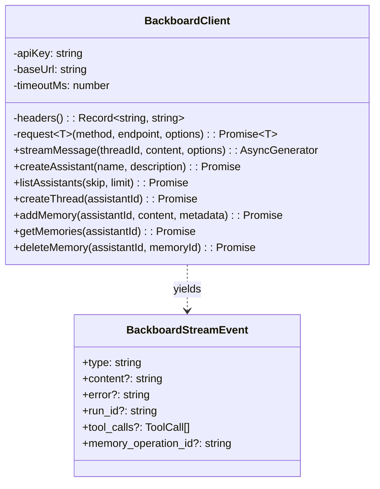

# Recipe 9: Custom HTTP Client

> **TypeScript** | **Intermediate** | [View Code](../recipes/ts_client.ts)

Build a typed Backboard client from scratch using `fetch`. Covers auth headers, timeout with `AbortController`, a generic `request<T>()` method, and SSE streaming via an async generator.

## When to Use This

- You're in a TypeScript/Node environment and want a lightweight client without the SDK
- You need full control over HTTP behavior (timeouts, retries, headers)
- You want to understand how the Backboard API works at the HTTP level
- You're building a custom integration that needs only a subset of the API

## Concepts

| Concept | Role in this recipe |
|---------|-------------------|
| **X-API-Key header** | Authentication for all Backboard API requests |
| **AbortController** | Timeout mechanism -- aborts the fetch after a deadline |
| **SSE streaming** | Server-Sent Events parsed from `data:` lines in the response body |
| **AsyncGenerator** | `streamMessage()` yields events as they arrive from the stream |

## Architecture



## Key Patterns

### Generic request method

```typescript
private async request<T>(method: string, endpoint: string, options?): Promise<T> {
  const controller = new AbortController();
  const timer = setTimeout(() => controller.abort(), this.timeoutMs);

  try {
    const res = await fetch(url.toString(), {
      method,
      headers,
      body,
      signal: controller.signal,
    });
    if (!res.ok) throw new Error(`Backboard API ${res.status}`);
    return (await res.json()) as T;
  } finally {
    clearTimeout(timer);
  }
}
```

### SSE streaming with async generator

```typescript
async *streamMessage(threadId, content, options): AsyncGenerator<BackboardStreamEvent> {
  const res = await fetch(url, { method: "POST", headers, body: formData });
  const reader = res.body.getReader();
  const decoder = new TextDecoder();
  let buffer = "";

  while (true) {
    const { done, value } = await reader.read();
    if (done) break;

    buffer += decoder.decode(value, { stream: true });
    const lines = buffer.split("\n");
    buffer = lines.pop() ?? "";

    for (const line of lines) {
      if (!line.trim().startsWith("data: ")) continue;
      const payload = JSON.parse(line.trim().slice(6));
      yield payload;
    }
  }
}
```

## Step by Step

1. **Constructor.** Takes `apiKey`, `baseUrl` (defaults to `https://app.backboard.io/api`), and `timeoutMs`. Strips trailing slashes from the URL.

2. **`headers()`** returns `X-API-Key` and `User-Agent` headers used on every request.

3. **`request<T>()`** is the core method. It builds the URL with query params, sets content type based on JSON vs FormData, creates an `AbortController` with a timeout, and makes the fetch call. Returns the parsed JSON response typed as `T`.

4. **`streamMessage()`** is an `AsyncGenerator`. It POSTs to `/threads/{id}/messages` with `stream=true` as form data. It reads the response body as a stream, splits on newlines, parses `data:` lines as JSON, and `yield`s each parsed event. Error events throw immediately.

5. **Convenience methods** (`createAssistant`, `listAssistants`, etc.) are thin wrappers around `request<T>()` with the right endpoint, method, and types.

## Gotchas

- **FormData for messages.** The Backboard `/messages` endpoint uses multipart form data, not JSON. The streaming endpoint requires `stream=true` as a form field.
- **Timeout for streaming is longer.** The recipe uses `timeoutMs * 3` for streaming requests since they can take much longer than regular API calls.
- **Buffer management.** SSE lines can be split across chunks. The `buffer` pattern accumulates partial lines and processes complete ones.
- **SyntaxError handling.** Malformed SSE lines are silently skipped. This handles keepalive pings or partial data.
