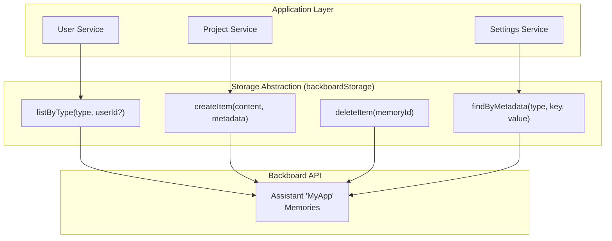
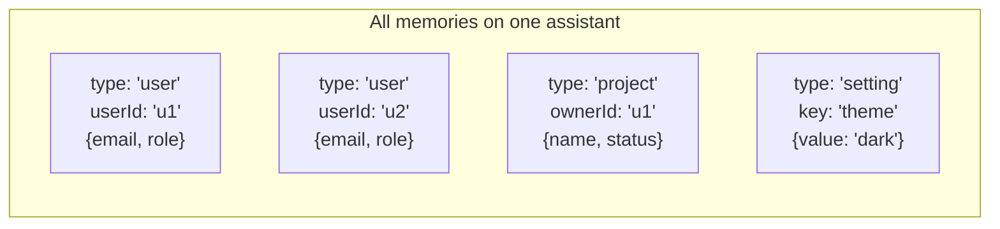

<p align="right"></p>

# Recipe 10: Storage Abstraction

> **TypeScript** | **Intermediate** | [View Code](../recipes/ts_storage_abstraction.ts)

A singleton storage layer that treats Backboard memories as a schemaless document store. One assistant acts as your database. `metadata.type` separates entity types. Provides `listByType()`, `createItem()`, `deleteItem()`, `findByMetadata()`.

## When to Use This

- You need a persistence layer but don't want to set up a database
- Your app stores multiple entity types (users, projects, settings)
- You want a clean abstraction between your app logic and Backboard API calls

## Concepts

| Concept | Role in this recipe |
|---------|-------------------|
| **Assistant** | Acts as the "database" -- one assistant per app |
| **Memory** | Acts as a "row" -- content is the data, metadata is the index |
| **metadata.type** | Acts as the "table name" -- filters entities by type |

## Architecture





## The Code

### Singleton client + assistant

```typescript
let client: BackboardClient | null = null;
let assistantId: string | null = null;

function getClient(): BackboardClient {
  if (client) return client;
  client = new BackboardClient(process.env.BACKBOARD_API_KEY!);
  return client;
}

async function getAssistantId(): Promise<string> {
  if (assistantId) return assistantId;
  const bb = getClient();
  const assistants = await bb.listAssistants();
  const existing = assistants.find((a) => a.name === "MyApp");
  if (existing) { assistantId = existing.assistant_id; return assistantId; }
  const created = await bb.createAssistant("MyApp", "Application data store");
  assistantId = created.assistant_id;
  return assistantId;
}
```

### listByType -- filter memories by metadata.type

```typescript
async function listByType(type: string, userId?: string): Promise<StoredItem[]> {
  const response = await bb.getMemories(aid);
  return response.memories
    .filter((m) => {
      const meta = m.metadata ?? {};
      if (meta.type !== type) return false;
      if (userId && meta.userId !== userId) return false;
      return true;
    })
    .map((m) => ({ id: m.id, content: m.content, metadata: m.metadata }));
}
```

### findByMetadata -- lookup by a specific field

```typescript
async function findByMetadata(type, key, value, userId?): Promise<StoredItem | undefined> {
  const items = await listByType(type, userId);
  return items.find((item) => item.metadata[key] === value);
}
```

## Step by Step

1. **Singleton client.** Created once, reused across all operations. The assistant ID is cached after the first lookup.

2. **Lazy assistant creation.** `getAssistantId()` checks for an existing assistant named "MyApp". Creates one if missing. This is idempotent.

3. **Type-based filtering.** Every memory gets a `metadata.type` field. `listByType("user")` returns only user memories. This is your "table" concept.

4. **Client-side filtering.** `get_memories()` returns all memories. Filtering happens in your code. This works well up to ~1000 memories per assistant.

5. **The `StoredItem` interface.** A normalized shape with `id`, `content`, `metadata`, and timestamps. Decouples your app from the raw Backboard memory shape.

## Gotchas

- **All filtering is client-side.** `getMemories()` returns everything. For large datasets, split across multiple assistants (see Recipe 12 for per-user isolation).
- **No transactions.** Delete + create is not atomic. Use write-first pattern (create new, then delete old) for safer updates.
- **Content is a string.** Always `JSON.stringify()` when storing and `JSON.parse()` when reading.
- **Singleton state.** The cached `client` and `assistantId` persist for the lifetime of the process. In serverless environments, this resets per invocation.

<p align="center"></p>
