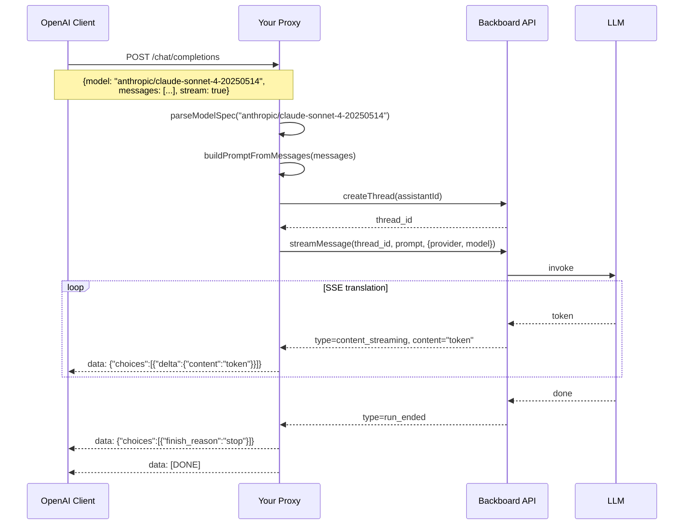

<p align="right"></p>

# Recipe 11: OpenAI-Compatible Proxy

> **TypeScript** | **Advanced** | [View Code](../recipes/ts_openai_proxy.ts)

Translate OpenAI `POST /chat/completions` requests into Backboard thread + message calls. Supports both streaming and non-streaming. Any OpenAI-compatible client can talk to Backboard through this proxy.

## When to Use This

- You have an existing app that uses the OpenAI API and want to switch to Backboard
- You're building a chat UI that expects OpenAI-format SSE chunks
- You want to use Backboard as a backend while keeping the OpenAI client interface
- You need to route to different LLM providers via the `model` field (e.g. `anthropic/claude-sonnet-4-20250514`)

## Concepts

| Concept | Role in this recipe |
|---------|-------------------|
| **Proxy** | Express middleware that translates between OpenAI and Backboard formats |
| **Model routing** | `"anthropic/claude-sonnet-4-20250514"` parsed into provider + model name |
| **Prompt building** | OpenAI message array flattened into a single prompt string |
| **SSE translation** | Backboard `content_streaming` events converted to OpenAI chunk format |

## Flow



## Key Patterns

### Model spec parsing

```typescript
function parseModelSpec(model: string): { provider?: string; modelName: string } {
  if (model.includes("/")) {
    const [provider, ...rest] = model.split("/");
    return { provider, modelName: rest.join("/") };
  }
  return { modelName: model };
}
// "anthropic/claude-sonnet-4-20250514" -> { provider: "anthropic", modelName: "claude-sonnet-4-20250514" }
// "gpt-4o" -> { modelName: "gpt-4o" }
```

### Prompt flattening

```typescript
function buildPromptFromMessages(messages: OpenAIChatMessage[]): string {
  // System messages -> [System Instructions]
  // Prior messages -> [Conversation History] (User: ... / Assistant: ...)
  // Last message -> [Current Message]
}
```

### SSE chunk translation

```typescript
// Backboard event:
// { type: "content_streaming", content: "Hello" }

// Becomes OpenAI chunk:
// { id: "chatcmpl-bb-xxx", object: "chat.completion.chunk",
//   choices: [{ delta: { content: "Hello" }, finish_reason: null }] }
```

## Step by Step

1. **Parse the request.** Extract `model`, `messages`, and `stream` from the OpenAI-format body.

2. **Parse the model spec.** Split `"anthropic/claude-sonnet-4-20250514"` into provider and model name. This lets clients specify any Backboard-supported model.

3. **Build the prompt.** Flatten the messages array into a single string with labeled sections. Backboard threads don't use the OpenAI message array format -- they take a single content string.

4. **Create a thread.** Each request gets a fresh thread. This is stateless from the client's perspective.

5. **Stream or collect.** For streaming, translate each Backboard SSE event into an OpenAI chunk and write it to the response. For non-streaming, collect all content and return a single response object.

6. **Model listing.** The `fetchModels()` function queries Backboard for available providers and models, formats them as `"provider/name"`, and caches for 1 hour.

## Gotchas

- **Thread-per-request.** The proxy creates a new thread for every request. Conversation history is passed via the messages array, not via thread state. This is intentional -- it keeps the proxy stateless.
- **Token counts unavailable in streaming.** Backboard reports tokens in `run_ended`, but OpenAI chunk format expects them in the final chunk. The proxy omits them in streaming mode.
- **Memory mode.** The proxy uses `memory="Auto"` by default. Set to `"Off"` for stateless interactions (e.g. folder-scoped chats in Nash).
- **Idle timeout.** Nash uses a 1.5s idle timer after the last content token to close the stream, handling cases where `run_ended` is delayed.

<p align="center" style="padding-top: 2em; padding-bottom: 2em;"></p>
