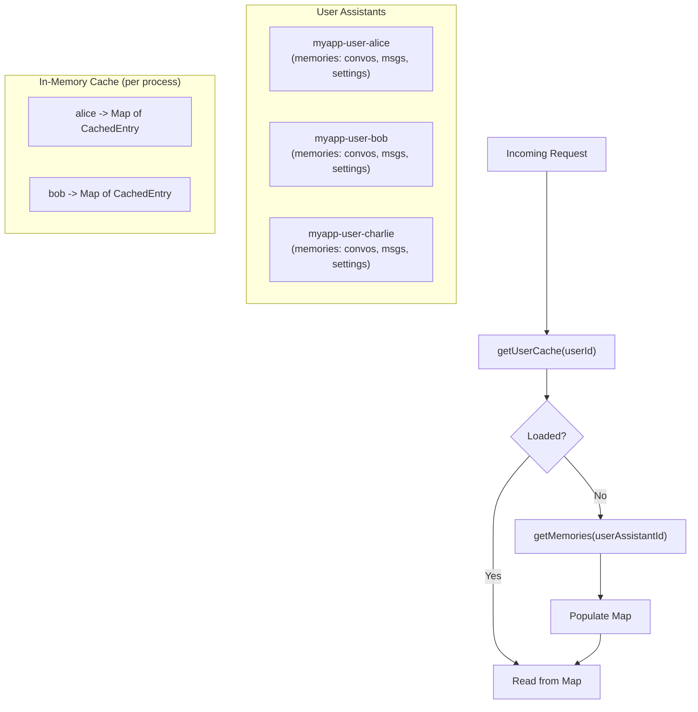
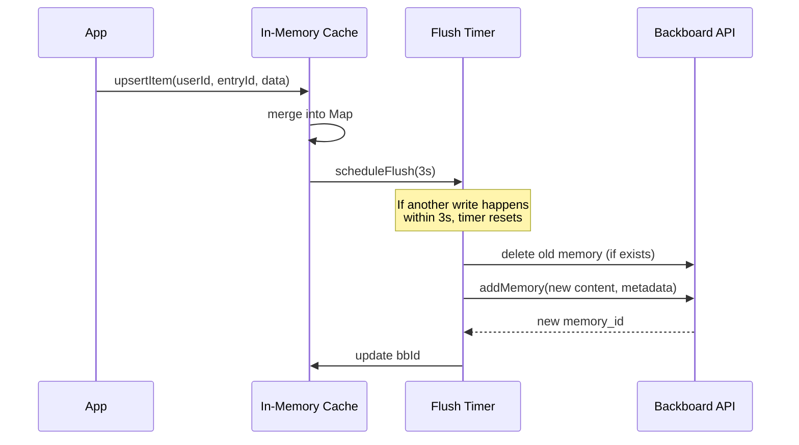

<p align="right"></p>

# Recipe 12: Per-User Data Isolation

> **TypeScript** | **Advanced** | [View Code](../recipes/ts_per_user_isolation.ts)

Create a dedicated Backboard assistant per user. Each user's data is fully isolated. In-memory cache with debounced flush to Backboard for write performance.

## When to Use This

- Your app has many users and each needs isolated data
- You're hitting performance limits with one assistant and thousands of memories
- You need strict data isolation between users (no cross-contamination)
- You want fast reads (cache) with eventual-consistency writes (debounced flush)

## Concepts

| Concept | Role in this recipe |
|---------|-------------------|
| **Per-user assistant** | Each user gets `myapp-user-{userId}` -- full memory isolation |
| **In-memory cache** | `Map<string, CachedEntry>` avoids repeat API calls for reads |
| **Debounced flush** | Writes go to cache immediately, sync to Backboard after a delay |
| **Delete-then-add** | Updates delete the old memory and create a new one |

## Architecture



## Write Flow



## The Code

### Per-user assistant creation

```typescript
async function getUserAssistantId(userId: string): Promise<string> {
  const cached = userAssistantIds.get(userId);
  if (cached) return cached;

  const bb = getClient();
  const name = `myapp-user-${userId}`;
  const assistants = await bb.listAssistants();
  const existing = assistants.find((a) => a.name === name);

  if (existing) {
    userAssistantIds.set(userId, existing.assistant_id);
    return existing.assistant_id;
  }

  const created = await bb.createAssistant(name, `Data store for user ${userId}`);
  userAssistantIds.set(userId, created.assistant_id);
  return created.assistant_id;
}
```

### Debounced flush

```typescript
function scheduleFlush(userId: string, entryId: string, type: string): void {
  const flushKey = `${type}:${userId}:${entryId}`;
  cancelPendingFlush(flushKey);

  const timer = setTimeout(() => {
    flushEntry(userId, entryId, type);
  }, FLUSH_DELAY_MS); // 3 seconds

  pendingFlushes.set(flushKey, timer);
}
```

### Content truncation

```typescript
function buildStorableContent(data: Record<string, unknown>): string {
  const raw = JSON.stringify(data);
  if (raw.length <= MAX_CONTENT_CHARS) return raw;
  return raw.slice(0, MAX_CONTENT_CHARS);
}
```

## Step by Step

1. **One assistant per user.** `getUserAssistantId("alice")` finds or creates `myapp-user-alice`. The ID is cached in a `Map` to avoid repeated lookups.

2. **Load cache on first access.** `getUserCache(userId)` calls `getMemories()` once, parses all memories into a `Map<entryId, CachedEntry>`. Subsequent reads are instant.

3. **Write to cache, flush later.** `upsertItem()` merges data into the cache `Map` immediately (fast) and schedules a flush via `setTimeout`. If another write hits the same entry within 3 seconds, the timer resets (debounce).

4. **Flush = delete + create.** The flush function deletes the old memory (using the cached `bbId`) and creates a new one. This is the standard update pattern for Backboard memories.

5. **Content truncation.** Large objects are truncated to `MAX_CONTENT_CHARS` (50KB) before writing. This prevents 400 errors from oversized content.

6. **Cache invalidation.** Call `invalidateUserCache(userId)` to force a reload from Backboard on the next access.

## Gotchas

- **Cache is per-process.** In a multi-process deployment, each process has its own cache. Writes in one process won't be visible in another until the cache is invalidated or reloaded.
- **Flush failure.** If the flush fails (network error, API issue), the data is still in the cache but not in Backboard. The entry's `bbId` remains empty, and the next flush will try again.
- **Delete is safe.** The `safeDeleteMemory` pattern ignores 404 errors (memory already deleted). This prevents cascading failures.
- **Assistant proliferation.** One assistant per user means lots of assistants. This is fine -- Backboard handles it. But track the mapping (user -> assistant_id) carefully.
- **Shutdown flush.** On process shutdown, pending flushes should be executed synchronously. Otherwise, data written in the last 3 seconds is lost.

<br />
<br />
<br />
<p align="center" style="padding-top: 2em; padding-bottom: 2em;"></p>
