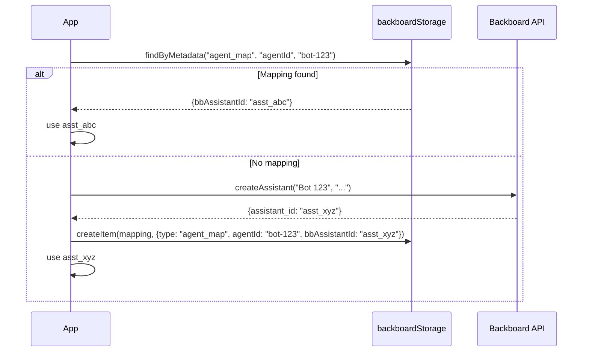
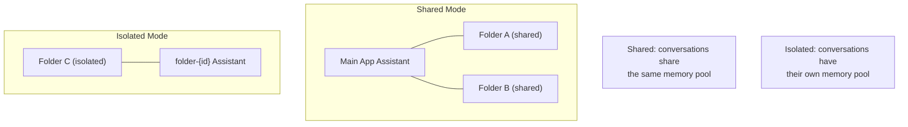

# Recipe 13: Entity-to-Assistant Mapping

> **TypeScript** | **Intermediate** | [View Code](../recipes/ts_agent_sync.ts)

Map external entities (agents, bots, folders) to Backboard assistants using metadata-stored mappings. Create assistants on-demand and track the relationship.

## When to Use This

- Your app has its own entity model (agents, bots, workspaces) that need Backboard assistants
- You want to lazily create assistants -- only when an entity first needs one
- You need to look up "which Backboard assistant belongs to this entity?"
- You want isolated or shared assistants depending on the use case

## Concepts

| Concept | Role in this recipe |
|---------|-------------------|
| **Mapping** | A memory that records `{agentId -> bbAssistantId}` |
| **Lazy creation** | Assistant is created only when first needed, not upfront |
| **Isolation** | Each mapped entity gets its own assistant (separate memories, threads) |
| **Shared mode** | For some entities, reuse the main app assistant instead of creating a new one |

## Flow



## Folder Isolation Pattern



## The Code

### Sync an entity to an assistant

```typescript
async function syncAgentToAssistant(params: {
  agentId: string;
  name: string;
  description?: string;
}): Promise<string> {
  // Check for existing mapping
  const existing = await backboardStorage.findByMetadata(
    "agent_map", "agentId", params.agentId
  );
  if (existing) return existing.metadata.bbAssistantId as string;

  // Create a new assistant
  const bb = backboardStorage.getClient();
  const assistant = await bb.createAssistant(params.name, params.description ?? "");

  // Store the mapping
  await backboardStorage.createItem(
    `Agent mapping: ${params.agentId} -> ${assistant.assistant_id}`,
    { type: "agent_map", agentId: params.agentId, bbAssistantId: assistant.assistant_id }
  );

  return assistant.assistant_id;
}
```

### Isolated vs shared folders

```typescript
async function createFolder(params: { folderId, name, shared }): Promise<FolderMapping> {
  let assistantId: string;

  if (params.shared) {
    assistantId = await backboardStorage.getAssistantId(); // reuse main assistant
  } else {
    const assistant = await bb.createAssistant(`folder-${params.folderId}`, "...");
    assistantId = assistant.assistant_id; // new isolated assistant
  }

  await backboardStorage.createItem(JSON.stringify(folder), {
    type: "folder", folderId: params.folderId
  });
}
```

## Step by Step

1. **Check for existing mapping.** Before creating anything, look for a memory with `type: "agent_map"` and the entity's ID. This makes the operation idempotent.

2. **Create assistant on first sync.** If no mapping exists, create a new Backboard assistant. The assistant name can mirror the entity name for easy identification.

3. **Store the mapping as a memory.** The mapping itself is a memory on the storage assistant (from Recipe 10). It records the relationship between your entity ID and the Backboard assistant ID.

4. **Lookup is fast.** `getAssistantForAgent(agentId)` scans memories once (cached by the storage layer) and returns the assistant ID.

5. **Shared vs isolated.** For folders/workspaces, you can choose: shared mode (reuse the main assistant, all data is visible) or isolated mode (new assistant, data is separate). Nash uses isolated folders for private workspaces.

## Gotchas

- **Mapping is the source of truth.** If you delete the mapping memory but not the assistant, you'll have an orphaned assistant. Always clean up both when deleting.
- **Assistant limits.** Creating many assistants (one per agent/folder) is fine, but be aware of any account-level limits.
- **Idempotency.** `syncAgentToAssistant()` checks first, creates if missing. Calling it multiple times for the same agent returns the same assistant ID.
- **Deletion cascade.** When deleting a mapped entity, decide whether to also delete the Backboard assistant. The `deleteAssistant` flag controls this.
